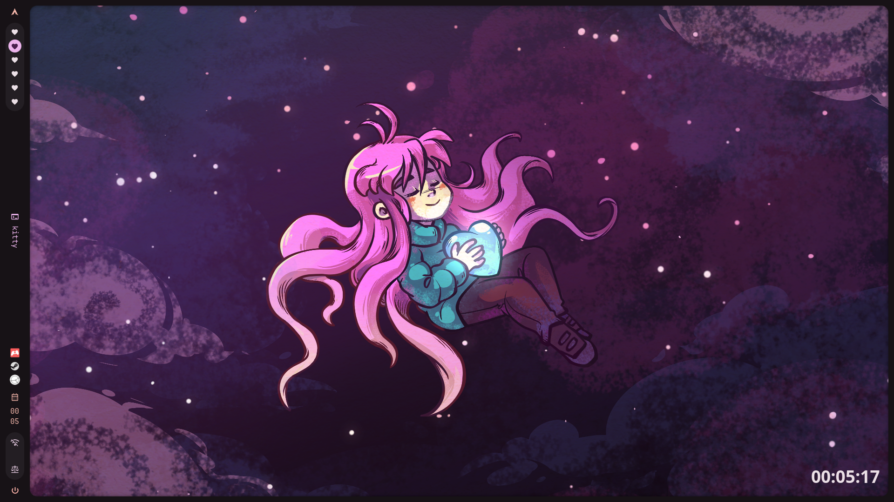
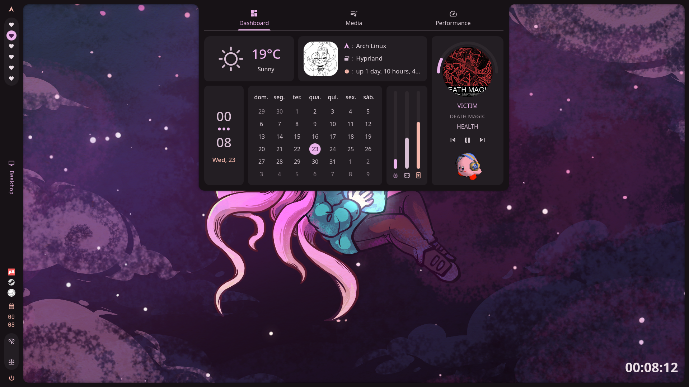

<h1 align=center> 🏳️‍⚧️ Vivi's Dotfiles🏳️‍⚧️</h1>
<p align=center> A Hyprland wpgtk based config, it's colour pallete will adapt to the wallpaper.</p>

<div align=center>
  
  
  
  

</div>


<div align=center>




</div>

## ⚠️ Currently in the middle of migrating to caelestia-shell
Btw you can open wpgtk and go into the keywords section to adjust the configs.

# Contents

## 🎨 Themes
* wpgtk (generates color palette from selected wallpaper and updates all configurations accordingly)
* ePapirus (icon theme used by rofi and polybar)
* GTK3-Adwaita (gtk theme)
* bibata-cursor-theme-bin (cool cursors lol)

## 🛠️ System Utils
* pipewire (Sound Software)
* pavucontrol (gui to change audio stuff)
* EasyEffects (Filters to improve your mic audio)
* nohang (kills processes that aren't responding)
* ananicy (auto nice deamon that automatically set's processes priorities )
* nm-applet (network management tray icon)
* sddm (display manager)
  
## 💾 CLI Programs
* kitty (terminal)
* nvim ( My UwUvim config lmao)
* btop (Haha look at my cool linux rice)
* xplr (Faster file explorer, aliased to x)
* ncmpcpp (music player, aliased to n)
* cava (Audio Visualizer)
* termdown (simple countdown timer)
* calcurse ( ncurses based calendary)
* scrcpy (can be used to screencast android to pc)

## 🖥️ GUI Programs 
* Social stuff:
	* vencord (discord client)
	* Postybirb (Manage various social media )
* Gaming : 
	* steam-runtime
	* prism launcher
* Creative Tools : 
	* ManusKript (Novel writing software)
	* Obsidian (markdown notetaking)
	* Krita (art software)
	* Onlyoffice 
	* Audacity
	* Blender
* General Stuff
	* Zen Browser
	* Syncthing
	* iriun webcam (use your phone as a webcam)
	* mpv (media player)
	* zathura (view pdfs)
	* Thunar file manager
	* qbittorrent
	* KeePassXC ( password manager)

# ⬇️ Installation
if you use something else than just change it in the following command.

```bash

# Will overwrite your local configs, make sure to back them up first!
git clone --bare https://github.com/vivivivianne/dotfiles $HOME/.cfg
alias dotfiles='/usr/bin/git --git-dir="$HOME/.cfg/" --work-tree="$HOME"'
dotfiles checkout -f
dotfiles config --local status.showUntrackedFiles no

# Downloading the needed packages (+ some extra stuff you might not use), might take a while
paru -S --needed $(echo ~/gitdotfiles/PC-Packages.txt)

# Update WPGTK Symlinks, add WPGTK wallpapers, and generate a colorscheme
$XDG_CONFIG_HOME/wpg/fix-symlinks.sh
wpg -a $XDG_CONFIG_HOME/Wallpapers/*
wpg -A $(wpg -l)

```
make sure you enable sddm and have files with correct permissions, then reboot.

### 🔃 Updating:
Just run the update script 

```bash
chmod +x ~/gitdotfiles/scripts/update.sh
~/gitdotfiles/scripts/update.sh
```

### 🗒️ ToDo:
- [x] Update the screenshots
- [ ] Create lists of needed packages, tools, and extra stuff
- [ ] Update readme, list only necessary software and mention the tools and extra stuff list
- [ ] Separate Personal configuration files in another repo (example, yt-dlp downloaded list, vim config , etc).
- [ ] Create Keybind list in Readme
- [ ] Create scripts for a backup system
